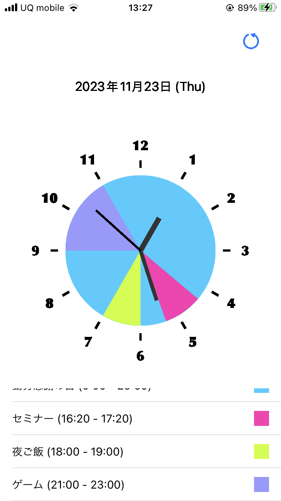

# EventClock

EventClockはiOS搭載カレンダーと連携し、予定を同期させることができるアプリケーションです。

  <kbd></kbd>

## 対応機種

iOS

## 使用言語

Swift

## 概要

EventClockはiOS搭載カレンダーと同期し、予定を確認することができます。このアプリケーションでは、iOS搭載カレンダーの予定とEventClockでの時刻を同時に確認できるため、効率的にスケジュールを把握・管理することができます。

## 主な機能

- iOS搭載カレンダーとの同期
- カレンダーの予定と時刻の同時表示
- その他の機能...

## インストール方法

現在審査中

## 使用方法

EventClockの基本的な使い方は、iOSに搭載されているカレンダーアプリに予定の内容と時間を入力。
EventClockで更新することで予定を反映し使います。

## 連絡先

a.syuto.1220.li@gmail.com
